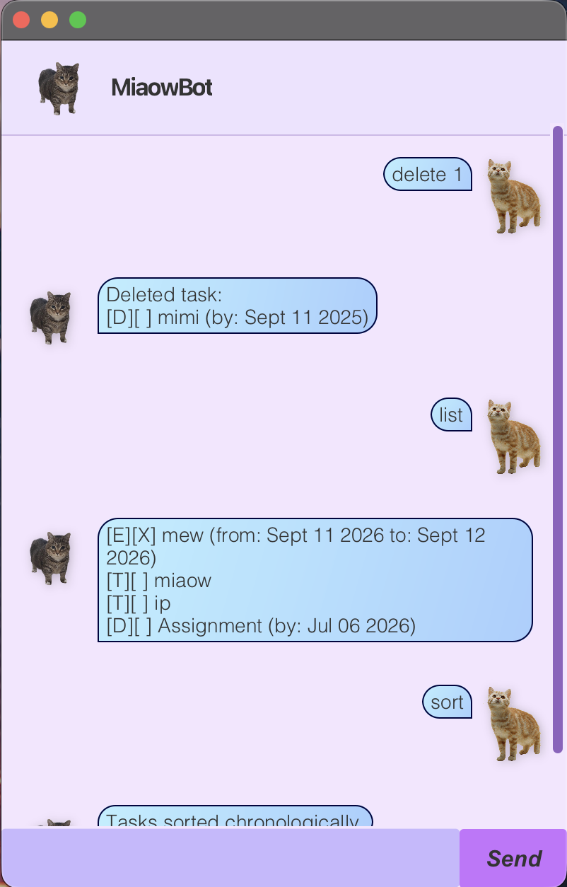

# MiaowBot User Guide
> The chatbot that miaows back



MiaowBot helps you manage three types of tasks:

- To-do tasks
- Deadlines
- Events

You can also list, find, sort, mark, unmark, and delete tasks. For some fun and whimsy


## Adding to-dos

Add a task without a deadline.

Example: `todo task`

This should add your task to the list, where you can later mark it as done

```
Got it! I've added this task:
[T][] task
```

## Adding deadlines

Add deadlines to keep track of all your tasks

Example: `deadline Assignment /by 2026-07-06`

This should add your task to the list, where you can later mark it as done

```
Got it! I've added this task:
[D][] Assignment (by: Jul 06 2026)
```
## Adding events

Add an event with a start and end time.

Example: `event Competition /from 2026-06-12 /to 2026-06-19`

This should add your task to the list, where you can later mark it as done

```
Got it! I've added this task:
[E][] Competition (from: Jun 12 2026 to: Jun 19 2026)
```
## Viewing your tasks

Use
`list`


## Marking as done

Use the task number shown on the list


Example: `mark 2`

This should mark the second task in your list as done

```
Marked task:
[T][X] task-name
```

## Finding a task

Search for a keyword in your task descriptions.

Example:

`find assignment`
## Sorting tasks

Sort tasks chronologically by their deadline or event start date.

Example:

`sort`

To-do tasks without dates appear after dated tasks.

## Deleting a task

Use the task number shown in your list.

Example:
`delete 2`

## Miaow

Use:
`miaow`

To say hi to the bot :)

## Exiting MiaowBot

Use:
`bye`

Your tasks will be saved automatically when you exit.


